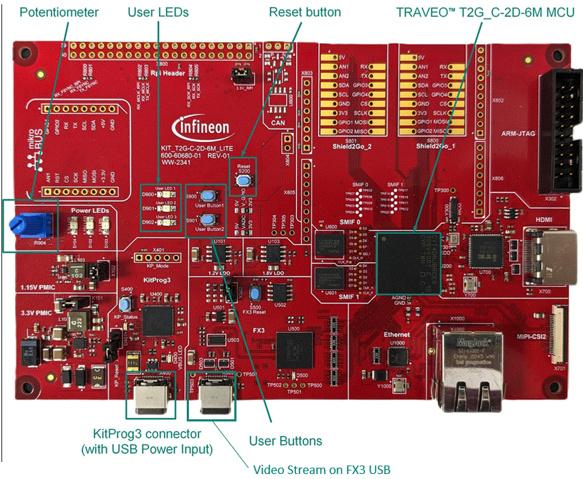

# Graphics Empty Template for graphics middleware
**This code example is a minimal starter graphics application template for TRAVEO&trade; T2G Cluster MCU devices. User can use this template as a base to create their own graphics example with Graphics middleware and display image via TRAVEO&trade; T2G Virtual Display Tool.**

The drivers used or available in this code example are listed below.

- [Graphics Driver for TRAVEO™ T2G cluster series user guide](https://myicp.infineon.com/sites/TRAVEODocumentation/Lists/defaultdoclib/Forms/AllItems.aspx?RootFolder=%2Fsites%2FTRAVEODocumentation%2FLists%2Fdefaultdoclib%2FTraveo%20II%2FTraveo%20II%20Cluster%2FGraphics&FolderCTID=0x01200023F2B2CA20D58647B6BFDE768454209B&View=%7BC8DBE6BD%2D4E7B%2D49A9%2D9267%2D2F926C13CB27%7D)
  - Chpater 4: Modules
  - Chapter 5: Classes
  
> **Note:** The above document are available on the myInfineon Collaboration Platform (MyICP). If not already available, please create a myInfineon account on [www.infineon.com](http://www.infineon.com/). Then, contact traveo@infineon.com and request access to TRAVEO™ T2G myICP.

- [JPEG decode driver user guide (TRAVEO™ T2G cluster series)](https://www.infineon.com/assets/row/public/documents/10/44/infineon-traveo-t2g-jpeg-decode-user-guide-usermanual-en.pdf?fileId=8ac78c8c8c3de074018c816028cf0ca8)
  - Chapter 2: JPEG decode driver

## Requirements

- [ModusToolbox&trade;](https://www.infineon.com/modustoolbox) v3.5 or later (tested with v3.5)
- This code example uses [TRAVEO&trade; T2G Virtual Display Tool](https://softwaretools-preview.icp.infineon.com/tools/com.ifx.tb.tool.traveot2gvirtualdisplaytool) to output image. This Tool is available only on Windows.

## Supported toolchains (make variable 'TOOLCHAIN')

- GNU Arm&reg; Embedded Compiler v11.3.1 (`GCC_ARM`) – Default value of `TOOLCHAIN`

## Device
The device used in this code example (CE) is:
- [TRAVEO&trade; T2G CYT4DN Series](https://www.infineon.com/cms/en/product/microcontroller/32-bit-traveo-t2g-arm-cortex-microcontroller/32-bit-traveo-t2g-arm-cortex-for-cluster/traveo-t2g-cyt4dn/)

## Board
The board used for testing is:
- TRAVEO&trade; T2G Cluster 6M Lite Kit ([KIT_T2G_C-2D-6M_LITE](https://www.infineon.com/cms/en/product/evaluation-boards/kit_t2g_c-2d-6m_lite/))

## Scope of work
In this example, it will provide initialization setting for graphics environment as commonly setting.

## Introduction  
**Graphics Subsystem**

The graphics subsystem is designed to fit into the TRAVEO&trade; T2G Cluster MCU (TVII-C-2D) devices. It connects to the CPU subsystem by an AXI master and slave port, and serves external interfaces for video input and output. This subsystem is a family of graphic cores and subsystems to cope with block image transfer (blit) and drawing operations for 2D graphic acceleration along with the video capture input and display output processing. It is implemented as a set of building blocks with unified concept and standardized interfaces.

**Features**

- Graphics core for rendering 2D
  - Image size up to 1600 x 800 pixels
  - All standard blit operations
  - Image scaling and rotation by any angle
  - Perspective correction for 3D effects (2.5D)
  - Compressed source images (lossless or lossy)
  - Accelerator for vector drawing (Bezier curve rasterization)
  - Command sequencer to minimize CPU interaction
  - Can render on-the-fly to display (except vector drawing)
- Display and composition engines
  - Two independent video output streams (such as cluster and HUD)
  - 220 MHz pixel clock, 2880 x 1080 active pixels, RGB format
  - Five transparent layers in total (alpha blending)
  - 26 windows in total (individual setup and frame buffers)
  - Four independent layer composition streams (safety)
  - One layer can be warped on-the-fly (HUD)
  - One layer can be upscaled on-the-fly
  - Gamma correction and dithering
  - CRC check on eight regions per display (safety)
- Capture engine for one video input stream
  - 220 MHz pixel clock, 2880 x 1080 active pixels (See device datasheet for the formats supported)
  - Frame rate conversion via ring buffer in video RAM
  - Downscaling (only if display does not upscale)
  - Feed-through on-the-fly to display with graphics overlay
- Video I/O interfaces (with maximum supported pixel clock frequencies)
  - Two FPD-link outputs (110 MHz) or 1 dual-channel output (220 MHz)
  - Two TTL outputs 24 bpp parallel (80 MHz) One TTL input 24 bpp parallel (80 MHz) or 8-/10-bit ITU 656 (40 MHz)
  - One MIPI CSI-2 input, maximum four lanes(220 MHz)
- JPEG decoder
  - JPEG image decompression from source to destination buffer in memory
  - Sequential 8-bit per sample Huffman decoding
  - Color formats YUV, gray scale, and RGB
  - YUV sub-sampling formats 4:4:4, 4:2:2, 4:2:0, and 4:1:1
  - Any image size between 1×1 and 16384×16384 pixels
  - Video performance up to 2880×1080 at 60 Hz
  - Packed destination buffers for YUV 4:4:4, gray, and RGB (8 and 24 bpp)
  - Semi-planar destination buffers for YUV 4:2:2, 4:1:1, and 4:2:0 (8 and 16 bpp)
  - Chroma up-conversion to 4:4:4 for all formats by sample replication

More details can be found in:
- TRAVEO&trade; T2G CYT4DN
    - [Technical Reference Manual (TRM)](https://www.infineon.com/products/microcontroller/32-bit-traveo-t2g-arm-cortex/for-cluster/t2g-cyt4dn#documents)
    - [Registers TRM](https://www.infineon.com/products/microcontroller/32-bit-traveo-t2g-arm-cortex/for-cluster/t2g-cyt4dn#documents)
    - [Data Sheet](https://www.infineon.com/products/microcontroller/32-bit-traveo-t2g-arm-cortex/for-cluster/t2g-cyt4dn#documents)

## Hardware setup

This CE has been developed for:
- TRAVEO&trade; T2G Cluster 6M Lite Kit ([KIT_T2G_C-2D-6M_LITE](https://www.infineon.com/cms/en/product/evaluation-boards/kit_t2g_c-2d-6m_lite/)) 

**Figure 1. KIT_T2G_C-2D-6M_LITE (Top View)**

 
No changes are required from the board's default settings.

## Implementation
This code example is a minimal starter graphics application template for TRAVEO&trade; T2G Cluster MCU devices. User can use this template as a base to create their own graphics example with Graphics middleware and display image via TRAVEO&trade; T2G Virtual Display Tool.
In this code example it will provide initialization setting for graphics environment as commonly setting.

**Initialize Graphics Environment**

Initialization of the Graphics environment with most commonly used settings and called in function *Cy_GfxEnv_FastInit()*.
* Calling *Cy_GfxEnv_Init()* to Initialize the environment of graphics.The parameters are setting by *stcGfxEnvCfg* which is structure *cy_gfxenv_stc_cfg_t* and this seting parameters can be found in the file *cy_gfx_env.c*.The initialization configuration structure for the GFX environment can be found in the file *cy_gfx_env.h*.

**Enable Graphics Subsystem Power Switch**

Enable the Graphics Subsystem Power Switch by function *Cy_PD_Enable()*.

**Configure Graphics Interrupt**

The configuration of the graphics interrupt is called in function *ConfigureVideoSSInterrupt()*.
* First, calling the function <a href="https://infineon.github.io/mtb-pdl-cat1/pdl_api_reference_manual/html/group__group__sysint__functions.html#gab2ff6820a898e9af3f780000054eea5d"><i>Cy_SysInt_Init</i></a> to initializes the referenced interrupt by setting the priority and the interrupt vector.
* Then, call *NVIC_ClearPendingIRQ* to clear the pending interrupt.
* Finally, call *NVIC_EnableIRQ* to enable the interrupt.

**Note**

- **ResourceGenerator**
  - The empty template is included the tool **ResourceGenerator**, the tool can be found in the file *\graphics_support\08_tool*.
      - The **ResourceGenerator** is an image conversion command line tool that can read a png file and convert it into a uint8 data array. 

- **Usage for ResourceGenerator**
  - The basic syntax for the usage of the ResourceGenerator is given below

        *ResourceGenerator.exe <srcFilename.png> [srcFilename2.png srcFilename3.png ...] [options ...]*

*The ResourceGenerator tool is provided as is. It is not officially supported.* 

*More information please check readme.txt it can be found in file graphics_support\08_tool\basic_graphics\bin\windows.*

## Run and Test

This code example only runs the commonly seting for initialization of graphics environment.

**Note:** You need to download [TRAVEO&trade; T2G Virtual Display Tool](https://softwaretools-preview.icp.infineon.com/tools/com.ifx.tb.tool.traveot2gvirtualdisplaytool) in advance. Because graphics example uses the FX3 controller to display.

After code compilation, perform the following steps to flashing the device:
1. Connect the board to your PC using the provided USB cable through the KitProg3 USB connector.
2. Program the board using one of the following:
    - Select the code example project in the Project Explorer.
    - In the **Quick Panel**, scroll down, and click **[Project Name] Program (KitProg3_MiniProg4)**.
3. After programming, the code example starts automatically the User LED1 blinking.

- You can debug the example to step through the code. In the IDE, use the **[Project Name] Debug (KitProg3_MiniProg4)** configuration in the **Quick Panel**. For details, see the "Program and debug" section in the [Eclipse IDE for ModusToolbox™ software user guide](https://www.infineon.com/assets/row/public/documents/30/44/infineon-modustoolbox-eclipse-ide-user-guide-usermanual-en.pdf?fileId=8ac78c8c8929aa4d0189bd07dd6113f9).

## References  
Relevant Application notes are:
- [AN235305](https://www.infineon.com/assets/row/public/documents/10/42/infineon-an235305-getting-started-with-traveo-t2g-family-mcus-in-modustoolbox-applicationnotes-en.pdf) - Getting started with TRAVEO&trade; T2G family MCUs in ModusToolbox&trade;

ModusToolbox&trade; is available online:
- <https://www.infineon.com/modustoolbox>
- [Graphics Driver for TRAVEO™ T2G cluster series user guide](https://myicp.infineon.com/sites/TRAVEODocumentation/Lists/defaultdoclib/Forms/AllItems.aspx?RootFolder=%2Fsites%2FTRAVEODocumentation%2FLists%2Fdefaultdoclib%2FTraveo%20II%2FTraveo%20II%20Cluster%2FGraphics&FolderCTID=0x01200023F2B2CA20D58647B6BFDE768454209B&View=%7BC8DBE6BD%2D4E7B%2D49A9%2D9267%2D2F926C13CB27%7D)
- [JPEG decode driver user guide (TRAVEO™ T2G cluster series)](https://www.infineon.com/assets/row/public/documents/10/44/infineon-traveo-t2g-jpeg-decode-user-guide-usermanual-en.pdf?fileId=8ac78c8c8c3de074018c816028cf0ca8)

ModusToolbox&trade; Graphics middleware is available online:
- <https://github.com/Infineon/tviic2d-gfx-mw>

Associated TRAVEO&trade; T2G MCUs can be found on:
- <https://www.infineon.com/cms/en/product/microcontroller/32-bit-traveo-t2g-arm-cortex-microcontroller/>

More code examples can be found on the GIT repository:
- [TRAVEO&trade; T2G Code examples](https://github.com/orgs/Infineon/repositories?q=mtb-t2g-&type=all&language=&sort=)

For additional trainings, visit our webpage:  
- [TRAVEO&trade; T2G trainings](https://www.infineon.com/training/microcontroller-trainings)

For questions and support, use the TRAVEO&trade; T2G T2G Forum:  
- <https://community.infineon.com/t5/TRAVEO-T2G/bd-p/TraveoII>  